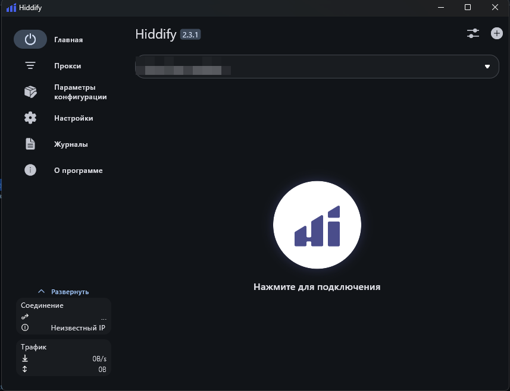
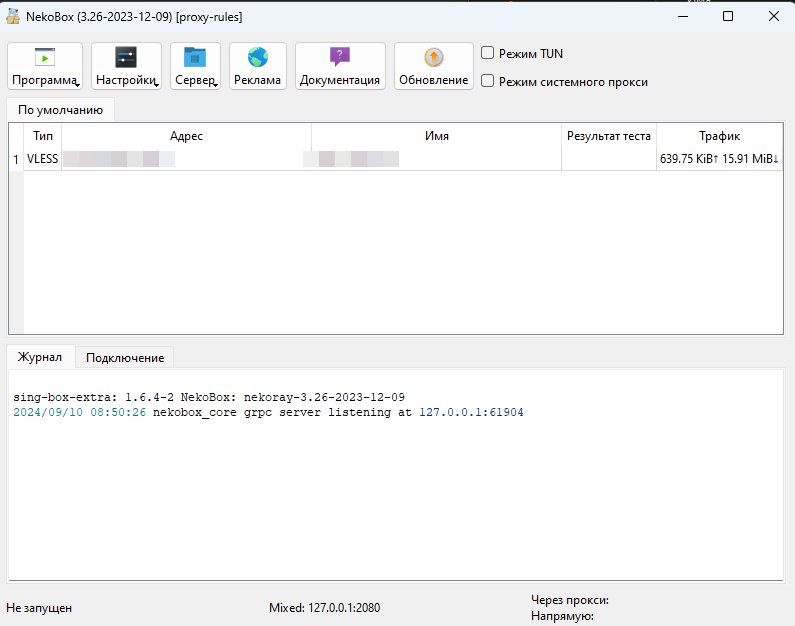
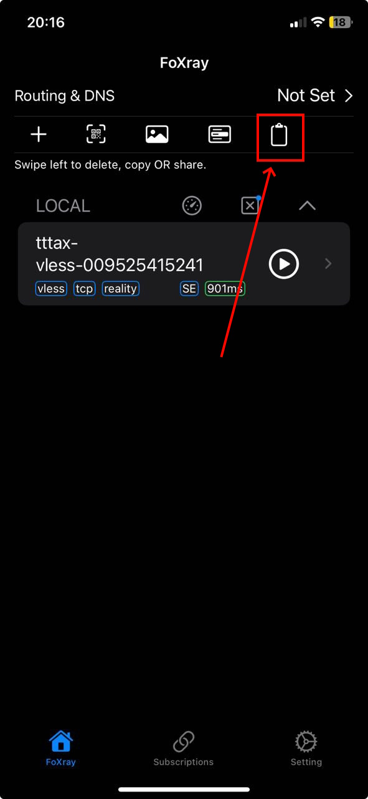
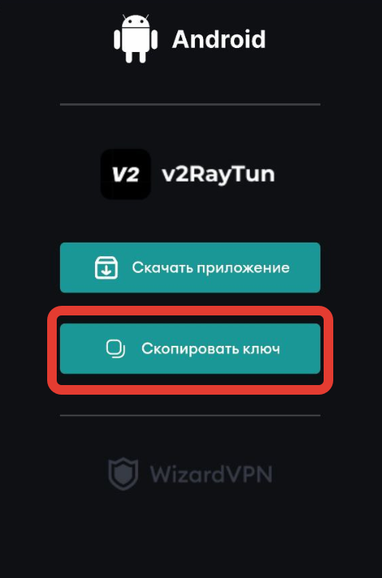

# 🔐 Инструкции к VLESS

В этой инструкции мы порекомендуем два клиента, которые подойдут пользователям в зависимости от их предпочтений **Hiddify** **NekoRay** и **v2rayTun**

<figure><figcaption></figcaption></figure>

При желании, вы можете использовать разные клиенты для разных устройств или для разных ситуаций.

### Hiddify 

<figure><figcaption></figcaption></figure>

#### Скачивание 

| Операционная система | Скачать                                                                                                                                                                                                                                                                                                                                                                                                                                                                                                                                                                                                                                                                                                                                                                                           |
| -------------------- | ------------------------------------------------------------------------------------------------------------------------------------------------------------------------------------------------------------------------------------------------------------------------------------------------------------------------------------------------------------------------------------------------------------------------------------------------------------------------------------------------------------------------------------------------------------------------------------------------------------------------------------------------------------------------------------------------------------------------------------------------------------------------------------------------- |
| iOS                  |                                                                                                                                                                                                                                                                                                                                                                                                                                                                                                                                                                                                                                            |
| Android              | 
   
 |
| Windows              | 
 
                                                                                                                                                                                                                                                                                                                                                                                     |
| MacOS                | 
 
                                                                                                                                                                                                                                                                                                                                                                                                     |
| Linux                | 
  
                                                                                                                                                                                                    |

#### Подключение 

Для подключения скопируйте ссылку профиля, затем нажмите **добавить профиль -> Добавить из буфера обмена**.

По умолчанию для российских пользователей обращения к российским IP и .ru доменам будет происходить напрямую. Если вы хотите направить их через VLESS, перейдите в раздел **Параметры конфигурации** и поменяйте **Регион** на **Другой**

Хорошо работают 2 режима работы:

1. **Системный прокси** (только на десктопных клиентах) - Hiddify прописывается как системный прокси и приложения сами отправляют трафик через него. Тем не менее, некоторые приложения могут отправлять трафик в обход системного прокси.
2. **VPN** - Hiddify создает TUN/TAP интерфейс и работает как VPN, перенаправляя весь трафик через себя. Для этого режима необходим запуск Hiddify с правами администратора. Можно навсегда прописать запрос таких прав в свойствах .exe файла.

### NekoRay 

<figure><figcaption></figcaption></figure>

#### Скачивание 

* NekoRay - клиент под Windows/Linux. [**Ссылка для скачивания NekoRay**](https://github.com/MatsuriDayo/nekoray/releases/latest)
* NekoBox - клиент под Android. [**Ссылка для скачивания NekoBox**](https://github.com/MatsuriDayo/NekoBoxForAndroid/releases/latest) (в GooglePlay фейк)

#### Подключение 

1. Для подключения скопируйте ссылку профиля, затем нажмите **Программа -> Добавить профиль из буфера обмена**.
2. Чтобы запустить или остановить профиль **ПКМ по профилю -> Запустить/Остановить**
3. Чтобы трафик шел через NekoRay должна быть установлена галочка **Режим TUN** или **Режим системного прокси** (разницу см. в разделе Hiddify). При отключении профиля галочку необходимо убирать, иначе интернет-соединения не будет. Стоит галочка - трафик идет в NekoRay, не стоит идет обычным путем.
4. Настройки фильтрации при необходимости можно добавить в **Настройки -> Настройки маршрутов -> Вкладка Базовые маршруты**. В нижнем правом углу задается назначение трафика, который не соответствует фильтрам. Примеры фильтров можно посмотреть загрузив китайский **Пресет**. Можно создать несколько наборов машрутов (первая вкладка) и переключаться между ними в **Программа -> Активное правило роутинга**.

### FoXray 

<figure><figcaption></figcaption></figure>

#### Скачивание 

Для добавления сервера **скопируйте ссылку профиля**, затем нажмите на кнопку для загрузки ссылки из буфера обмена (**обведена на скриншоте**, самая правая)\
\

## Подключение с Android

* Скачиваем приложение [v2rayTUN](https://play.google.com/store/apps/details?id=com.v2raytun.android\&hl=ru)
* Заходим в [меню управления подпиской](https://wizardvpn.app/profile/vpns) и нажимаем "Подключиться"
* Вас перекинет на выбор подключения, мы нажимаем на "Скопировать ключ"

<figure><figcaption></figcaption></figure>

* Вам нужно зайти в приложение **v2rayTUN** и сверху справа нажать на **"+"**, после на **"Вставить из буфера обмена"**
* После этих действий профиль появится в приложении, останется только подключиться

<figure><figcaption></figcaption></figure>
