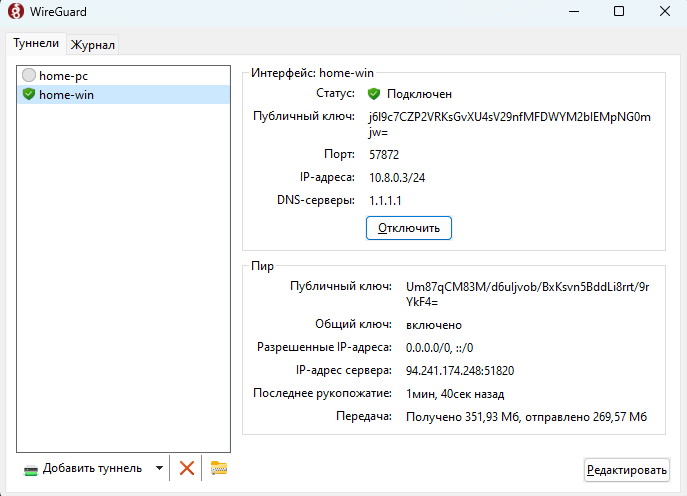

# 🌌 Инструкция к WIREGUARD

#### Android/IOS 

Для запуска на смартфоне нужно скачать с GooglePlay официальный клиент, [ссылка на все клиенты(Windows, Android, IOS) ](https://www.wireguard.com/install/)\
\
Далее нужно открыть приложение > отсканировать QR-код с web-интерфейса > нажать «**Подключиться**». Либо использовать файловую конфигурацию с сайта.

<figure><figcaption></figcaption></figure>

<figure><figcaption></figcaption></figure>

Проверьте IP-адрес на сайте [2ip.ru](https://2ip.ru/). Вижу IP-адрес сервера — значит, все работает.\

#### Windows  

Для подключения нужно:

* Скачать клиент для Windows можно с [официального сайта](https://www.wireguard.com/install/?roistat_visit=2271018).
* В веб-интерфейсе скачать конфигурационный файл.
* Запустить клиент > Добавить туннель > Выбрать файл -> Нажать «**Подключить**».

<figure><figcaption></figcaption></figure>


При возникновении проблемы с блокировкой WireGuard, замените локацию в панели управления VPN, либо обратитесь в тех поддержку. Мы обязательно вам поможем!

