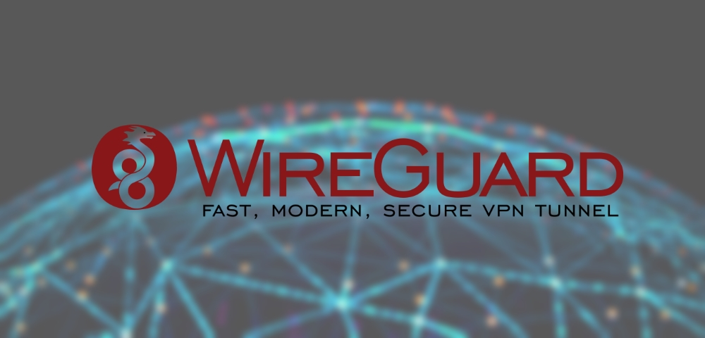
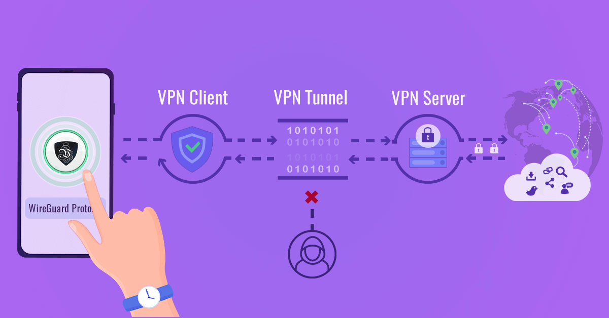

# 🧨 🛡️Преимущества WIREGUARD в современных реалиях

<figure><figcaption></figcaption></figure>

**Преимущества WireGuard в современных реалиях:**

1. **Высокая скорость соединения**:\
   WireGuard использует современные криптографические алгоритмы, что позволяет достигать высокой скорости соединения при минимальной нагрузке на систему. Это особенно важно в условиях, когда нужно обходить блокировки и при этом поддерживать хорошую пропускную способность.
2. **Простота настройки и использования**:\
   Одним из главных преимуществ WireGuard является его простота в настройке. Он имеет минималистичный код (около 4000 строк кода), что делает его легким в установке и использовании. Это особенно удобно для новичков, так как нет необходимости в сложных конфигурациях и настройках. Базовая установка и подключение обычно не требует больших технических знаний, что делает WireGuard отличным выбором для людей, которые не имеют глубоких знаний в области сетевых технологий.
3. **Безопасность**:\
   WireGuard использует современные криптографические методы, такие как Curve25519, ChaCha20, Poly1305, BLAKE2s, которые обеспечивают высокий уровень безопасности. Он имеет меньший шанс быть уязвимым перед новыми методами атак, чем старые VPN-протоколы, такие как PPTP и L2TP.
4. **Эффективность на мобильных устройствах**:\
   Протокол потребляет меньше ресурсов процессора, что особенно важно для мобильных устройств. Это делает WireGuard удобным вариантом для использования на смартфонах и планшетах, где важно экономить батарею.
5. **Поддержка мультиплатформенности**:\
   WireGuard поддерживается на множестве операционных систем, включая Linux, Windows, macOS, Android и iOS. Это позволяет использовать его на различных устройствах и легко синхронизировать соединения между ними.

<figure><figcaption></figcaption></figure>

### WIREGUARD в России

**Плюсы и минусы для жителей России:**

**Плюсы:**

1. **Обход блокировок и высокая производительность**:\
   В отличие от других традиционных VPN-протоколов, таких как OpenVPN, WireGuard более сложно обнаружить и заблокировать. Это особенно актуально в России, где существуют различные методы блокировки VPN-сервисов и обхода цензуры. Однако стоит отметить, что в последние годы протокол все чаще становится объектом блокировок.
2. **Малый размер и простота конфигурации**:\
   WireGuard использует всего несколько файлов конфигурации, что значительно облегчает его установку и настройку для пользователей, не обладающих техническими навыками. Простота использования — это ключевая особенность, которая привлекает пользователей, не желающих тратить много времени на настройки. Особенно это подходит для новичков, которым важно не запутаться в сложных интерфейсах.
3. **Высокий уровень безопасности**:\
   В условиях растущего внимания к безопасности и конфиденциальности, WireGuard предоставляет современную криптографию с высоким уровнем защиты, что особенно важно в России, где вопросы безопасности личных данных становятся актуальными.
4. **Быстрая настройка для обхода цензуры**:\
   Несмотря на блокировки, даже в условиях ограничений WireGuard может обеспечивать стабильное соединение, особенно при использовании специфичных настроек или серверов, которые не попадают под общие блокировки.

**Минусы:**

1. **Блокировки в России**:\
   Одним из основных недостатков для жителей России является то, что протокол WireGuard все чаще попадает под блокировки. Провайдеры и службы безопасности могут обнаружить и заблокировать IP-адреса или серверы, использующие WireGuard. В некоторых случаях блокировки происходят на уровне DPI (глубокая проверка пакетов), что делает соединение с использованием WireGuard трудным или невозможным.
2. **Ограниченная поддержка в некоторых странах и сервисах**:\
   Некоторые старые устройства или сервисы могут не поддерживать WireGuard, поскольку это относительно новый протокол. Хотя это изменяется с каждым годом, для некоторых пользователей это может быть ограничением.
3.  **Проблемы с подключением в условиях сильной цензуры**:\
    В России, где VPN и другие способы обхода цензуры активно блокируются, пользователям может быть сложно найти рабочие серверы WireGuard или подключиться к ним, если они находятся под блокировками. В отличие от OpenVPN или Shadowsocks, которые могут использовать более разнообразные методы обхода блокировок (например, через нестандартные порты или TLS-шифрование), WireGuard чаще всего работает на стандартных портах, что делает его уязвимым к блокировкам.\
    \
    **Вывод:**

    WireGuard — это отличный выбор для пользователей, ищущих легкость в настройке, высокую скорость и безопасность. Однако для жителей России важно учитывать текущие риски блокировок и ограничений, связанных с этим протоколом. Несмотря на это, его простота и эффективность делают его очень удобным для начинающих, и при определенных условиях он может быть отличным решением для обхода цензуры.
